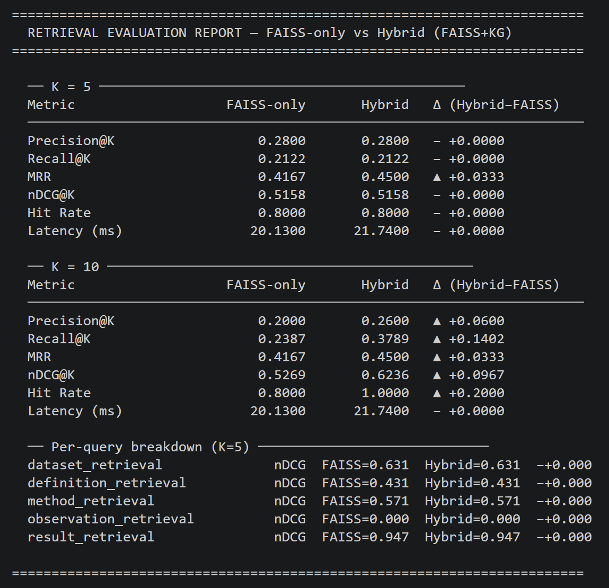

# 📄 AgenticDoc — Multi-Agent Document Understanding System

An end-to-end agent-based pipeline for extracting, structuring, and querying information from academic PDFs using layout analysis, semantic understanding, knowledge graphs, and hybrid retrieval (FAISS + KG).

## 🚀 Overview

AgenticDoc is designed to transform raw PDFs into structured, queryable knowledge. It combines multiple specialized agents to process documents step by step:

- Extract content from PDFs
- Detect layout (titles, paragraphs, figures, etc.)
- Understand semantics
- Build a knowledge graph
- Enable retrieval using FAISS + Hybrid search
- Generate answers using LLMs

## 🧠 Architecture
PDF → Extraction → Layout Detection → Semantic Understanding
→ Knowledge Graph → Retrieval (FAISS + Hybrid)
→ Answer Generation


Each stage is handled by a dedicated agent for modularity and extensibility.

## ⚙️ Features

- 📄 PDF text extraction (with OCR fallback)
- 🧩 Layout detection (titles, paragraphs, figures, tables)
- 🧠 Semantic classification (Method, Result, Definition, etc.)
- 🕸️ Knowledge Graph construction (GraphML output)
- 🔍 FAISS-based semantic search
- 🔗 Hybrid retrieval (FAISS + Graph reasoning)
- 🤖 LLM-based answer generation (Ollama / Grok support)
- 📊 Evaluation metrics for retrieval performance
- 🎨 Visualization tools (layout, alignment, graph)

## 📂 Project Structure

* agents/                     # Core pipeline agents
* extractors/                 # PDF & layout extraction logic
* output/                     # Generated outputs (JSON, graph, * FAISS index)
* tests/                      # Unit tests
* plots/                      # Visualization outputs
* pdf/                        # Input documents
* main.py                     # Entry point
* pipeline.py                 # Pipeline orchestration
* ui.py                       # Streamlit UI
* retrieval_evaluation.py     # Evaluation script
* run_*.py                    # Individual stage runners


## 🛠️ Installation

### 1. Clone the repository

```bash
git clone https://github.com/saikiranvankudothu/agenticdoc2.git 
cd agenticdoc2
```
## Create virtual environment with uv
```
uv init 
uv sync

```
## Run full pipeline

```
python pipeline.py --pdf pdf/paper.pdf

```

# output metrics


